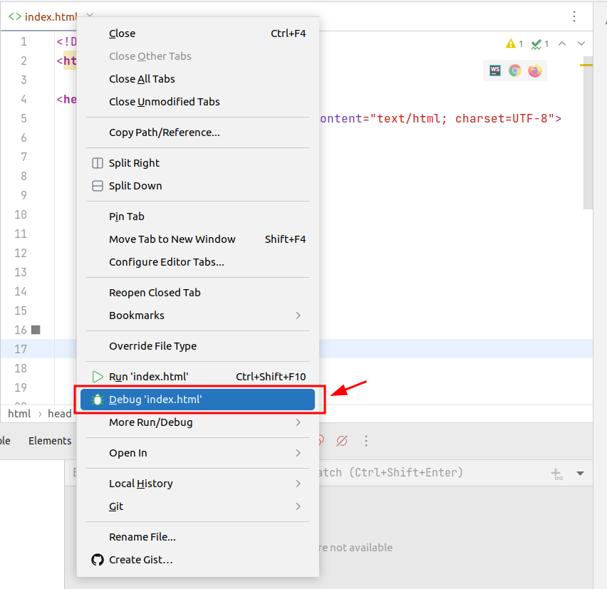
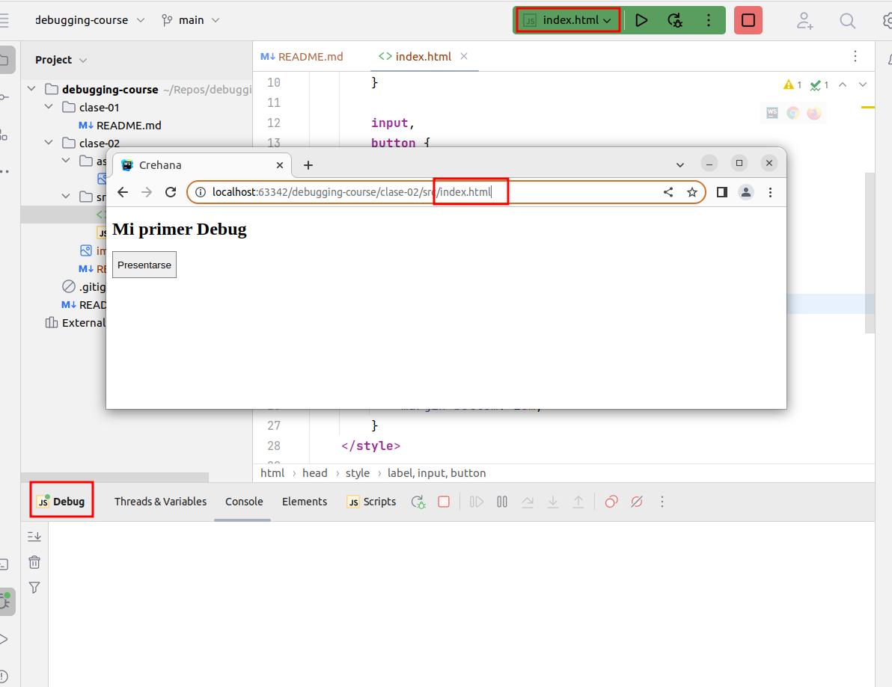

# Clase 02 - Fundamentos de Debugging: Breakpoints

1. [Objetivos de la clase](#objetivos-de-la-clase)
2. [Contenido](#contenido)
   1. [Primer Debug](#primer-debug)
   2. [Breakpoints](#breakpoints)
   3. [Step Over, Step Into y Step Out](#step-over-step-into-y-step-out)
   4. [Introducción y primer fix](#introducción-y-primer-fix)
   5. [Historia de Debugging](#historia-de-debugging)
3. [Material Complementario](#material-complementario)

## Objetivos de la clase

---

- Entender los fundamentos, qué es un bug, empezar a usar las priemra 
herramientas para empezar a eliminar los bugs de forma eficiente y metódica.   


## Contenido

---
### Primer Debug

Un **bug** es un error, un comportamiento no deseado en nuestro código. 
El proceso de debugging consiste en eliminar estos bugs con el uso de distintas
herramientas, a partir del descubrimiento del bug, vamos a analizar el estado de
la aplicación para entender su origen.

> Nota: el código usado en este curso ya viene con el contenido, no fue hecho
por mí.

En el curso se muestra como empezar a debuggear con VS Code (creando el archivo
launch.json), por mi parte hago lo mismo pero con WebStorm. Como el Proyecto 1
consta de un archivo `index.html` y uno `script.js`, solamente tengo que abrir
el archivo HTML, hacer clic derecho en la pestaña y tocar _Debug 'index.html'_



Esto nos abre un navegador con una sesión de debugging asociada a nuestros 
archivos:



Si apretamos el botón **_Presentarse_** vemos que falla, no se muestra el nombre,
esto lo vamos a solucionar en el siguiente paso.


### Breakpoints

Es la herramienta más usada a la hora de hacer debugging, es un punto de 
interrupción que detiene la ejecución del programa, y en ese momento nos va a 
permitir ver el estado general del programa.

Para usarlos, vamos a ir a nuestro archivo `script.js` y hacer clic en donde 
está el número de la línea 6, haciendo esto va a aparecer el punto rojo que 
representa el breakpoint, y la línea también se va a pintar de rojo, para que 
sea más fácil verla.


Corremos nuestro programa de nuevo en modo debug, y ahora cuando apretamos el 
botón de **_Presentarse_** vemos cómo se resaltó la línea que habíamos marcado:


Y la ejecución se detuvo en el navegador, con un mensaje aclaratorio 
**_"Paused in debugger"_**:


En WebStorm (o cualquier otro IDE) vamos a tener una ventana que nos va a 
mostrar las herramientas para hacer debugging. En mi caso, la combinación 
`alt`+`5` abre esta vista:


Colocamos algunos breakpoints más y le damos a **_Resume Program_** (`F9` en mi 
caso). 


Vemos como ahora el programa "saltó" al siguiente breakpoint, es importante 
entender que la línea resaltada **todavía no se ejecutó**. Los breakpoints no
son instrusivos con el código, pueden agregarse y sacarse durante el tiempo de
ejecución. Vemos que el valor de la variable `introduction` es `undefined`. 
Si seguimos un paso más:


Ahora vemos que el valor de `introduction` pasó a ser **_"Mi nombre es "_**, y 
que se creó variable `completeName` (lógicamente con valor `undefined`).
Si le damos a `F9` y no hay más breakpoints por delante, la ejecución del 
programa sigue su flujo normal hasta terminar.

En WebStorm con la combinación `ctrl`+`shift`+`F8` vamos a abrir una ventana que
nos muestra los breakpoints que pusimos en nuestro ćodigo:


A la izquierda vemos el archivo y la línea en donde está el breakpoint, y dentro 
de cada breakpoint, vamos a poder manipularlo (deshabilitarlo, suspender la 
ejecución o no, agregar una condición, etc.)

### Step Over, Step Into y Step Out

Los **steps** nos permiten tener un manejo más granular sobre el código
a la hora de hacer debugging. Hay tres tipos:
- _Step Over_: avanza a la siguiente línea, si no tiene línea, termina la 
interrupción del código.<br /><br />

_Vemos cómo al hacer click en Step Over, la ejecución sigue con la siguiente 
línea, sin entrar en ninguna función_<br /><br />
- _Step Into_: entra a la función que se está ejecutando en la línea donde 
estamos parados. <br /><br />

_Con el Step Into, vemos como la ejecución sigue dentro de la función que está
siendo invocada en este momento_ <br /><br />
- _Step Out_: sale de la función en la que estamos y salta al paso próximo a la 
finalización de la ejecución de la función.<br /><br />
<br />
_Para probar el Step Out, colocamos el breakpoint en la línea 21, hacemos un 
Step Into, en la función **getSurname()**, y cuando hacemos un Step Out, vemos 
como el cursor vuelve a la línea 21, porque todavía no terminó toda la 
ejecución, falta la ejecución de la función **getFirstName()**._<br /><br />

_Notar como el cursor ya se posiciona a la izquierda de **getFirstName()**, el 
cursor nos indica en que punto continúa la ejecución de nuestro programa_<br />
<br />


Ayudándonos con los steps logramos encontrar que el error en nuestro programa
estaba en las funciones **getFirstName()** y **getSurname()**. Completamos las
funciones con nuestro nombre y apellido, y probamos de nuevo:


---
### Introducción y primer fix

Para poner en práctica lo anterior, vamos a usar el proyecto final del curso.


La aplicación es una página con un listado de items, que cuenta con la 
posibilidad de agregar esos items a favoritos, un inicio de sesión local y un 
listado de frases relacionadas a los items. Se compone por:

- `dependencies`, librerias de CSS y JS para la estética de la app.
- `favorites.js`, funciones de agregar y quitar favoritos
- `items.js`, guarda la información de los items
- `lists.js`, contiene las funciones para generar los listados de los items.
- `quotes.js`, funciones relacionadas con la frase destacada
- `session.js`, funciones relacionadas al inicio y cierre de sesión.

Si cargamos la página en un principio no tiene nada de información:


Vamos a agregar items al archivo `items.js`, siguiendo el siguiente formato de
array:
```
let items = [
   {
      'title': 'Titulo item',
      'subtitle': 'Subtítulo item',
      'imageUrl': 'url imagen'
   },
   {
      'title': 'Titulo item2',
      'subtitle': 'Subtítulo item2',
      'imageUrl': 'url imagen2'
   }
]
```

Una vez agregados los items al archivo:


Ya podemos ver como se muestran en la aplicación:


Como ejercicio vamos a tener que arreglar dos bugs:`

- Del listado de items, hay uno que no aparece (en mi caso, el primer manga de 
la lista)
- Al iniciar sesión, aunque usemos las credenciales correctas (**usuario**: 
crehana, **password**: crehana123) no nos deja ingresar.`


#### Solución

Para el primer error busco la función que alimenta la lista de items, en el
archivo `lists.js` el método **fillAllList()**,


Vemos que al iterar sobre la lista, empieza sobre el índice 1, y los arrays
(por lo menos en JS), empiezan desde el índice 0. Por esto se está salteando el
primer item. Cambiamos por `i = 0` y probamos de nuevo:


Para el segundo error buscamos donde se hace el inicio de sesión. Es en el 
archivo `session.js`, ubicamos la función **login** y procedemos con el
debugging:


Vemos que **user** no tienen el valor que se ingresó en el input, sino que es el
elemento input completo (con todos los atributos).
Cambiamos la línea que obtiene el valor: `document.getElementById('user');`
por `document.getElementById('user').value;`. 
En el caso de password, en la línea 18, se usa `password.value`, por lo que el
error no se repite:


Haciendo un Step Over, vemos que el código ya no sale por el **else**, y nos
podemos loguear correctamente.

### Historia de Debugging

El origen del término se popularizó cerca de 1945, en la Universidad de Harvard,
uno de los equipos tuvo problemas con una de las primeras máquinas que 
existieron (Harvard Mark II). Se encontraron con una polilla en un relé, la 
sacaron y la pegaron en la documentación para dejar nota de la corrección del 
error (la palabra **bug** para referirse a un error igual data de antes, se le 
atribuye a Thomas Edison).
Así fue evolucionando, pasando por breakpoints físicos en las máquinas de 
tarjetas, hasta las herramientas que usamos hoy en día.

## Material Complementario

---

- JetBrains Team. (2022, Septiembre 28). Debug JavaScript in Chrome. _Jetbrains_
https://www.jetbrains.com/help/webstorm/debugging-javascript-in-chrome.html#ws_js-debug_reload_current_page
- Multiple Authors. (2023, Febrero 22). Debugging. _Wikipedia_
https://en.wikipedia.org/wiki/Debugging
- Matthew Wills. (2022, Mayo 3). The Bug in the Computer Bug Story. _JSTOR Daily_
https://daily.jstor.org/the-bug-in-the-computer-bug-story/